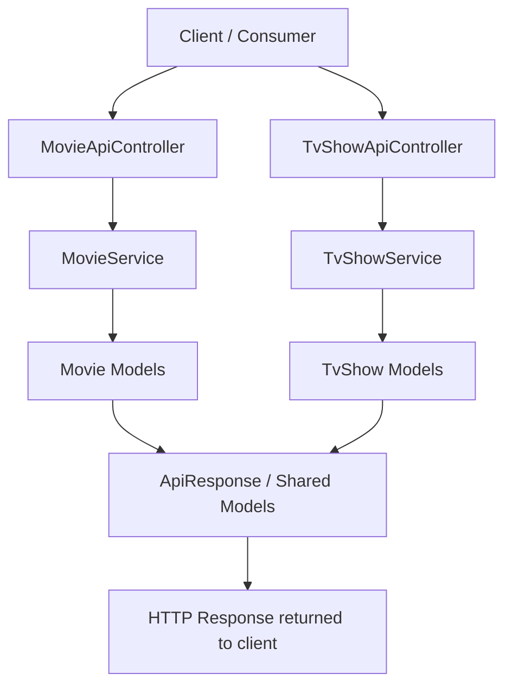

# Movie Library

A .NET Web API for managing a collection of movies and TV shows.

## Scoping

- CRUD operations for all endpoints
- List of movies
- List of TV shows
- Wishlist

### Stretch Goal

Implement a React frontend that connects to the backend API.

## Structure

The project currently follows a layered API structure:

- .NET Web API with MVC
- Controller layer
- Model layer
- Service layer
- Interfaces where needed

### Main Project Areas

- `movieLibraryAPI/Controllers`
  - `MovieApiController.cs`
  - `TvShowApiController.cs`
- `movieLibraryAPI/Services`
  - `MovieService.cs`
  - `TvShowService.cs`
- `movieLibraryAPI/Models`
  - API response models
  - genre enum
  - movie and TV show models
  - list models and interfaces

## TODO

- [x] Start folder and file structure
- [x] Add xUnit for future testing
- [x] Create model for lists (generic list)
- [x] Create models for Movies and TvShows
- [x] Create Enum for Genres
- [x] Start service file for tv-shows
- [x] Add Swagger

## Flowchart

## Request Flow

1. A client sends a request to the API.
2. The request is handled by either:
   - `MovieApiController`
   - `TvShowApiController`
3. The controller delegates logic to the matching service:
   - `MovieService`
   - `TvShowService`
4. The service works with models and shared response objects.
5. The API returns a structured response to the client.

## Tech Stack

- C#
- .NET Web API
- xUnit for testing
- Swagger for API documentation

## Notes

This project is focused on building a clean backend structure for handling movie and TV show data. It is designed to be extendable, with a possible frontend integration planned as a stretch goal.
