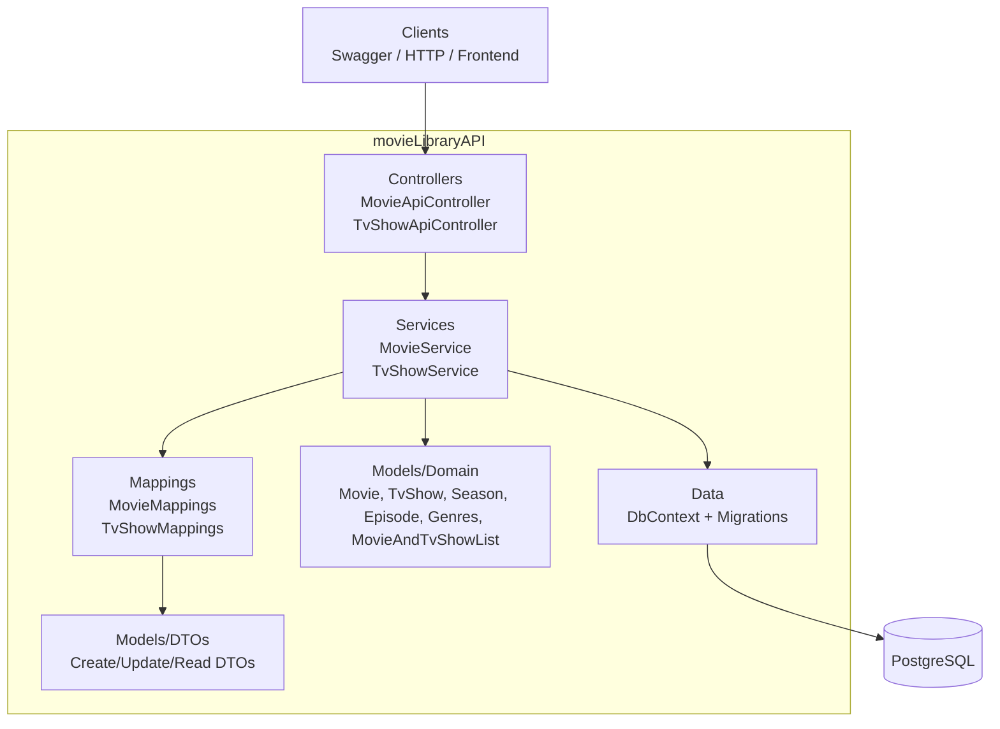

# Movie Library API

A .NET Web API for managing movies, TV shows, seasons, episodes, and mixed media lists.

## Current Status

This project now uses:

- ASP.NET Core Web API (`net10.0`)
- Entity Framework Core
- PostgreSQL (`Npgsql`)
- EF Core Migrations
- Swagger / OpenAPI
- Layered structure with controllers, services, mappings, DTOs, and domain models

---

## TODO for project

-[x] Create User model
-[x] Make login service file
-[x] Decide between bcrypt and Argon2
-[x] Make DTOs for Users
-[ ] Create IUserRepository and UserRepository
-[ ] Make IRecoveryTokenRepository + RecoveryToken entity/table
-[ ] Make AuthController (register/login/recovery endpoints)
-[x] Create PasswordPolicyValidator (length/complexity rules)

## Features

- CRUD operations for Movies
- CRUD operations for TV Shows
- TV Shows include Seasons and Episodes
- Combined list model (`MovieAndTvShowList`) with many-to-many relations to:
  - `Movie`
  - `TvShow`

---

## Project Structure



- `movieLibraryAPI/Controllers`
  - `MovieApiController.cs`
  - `TvShowApiController.cs`
- `movieLibraryAPI/Services`
  - `MovieService.cs`
  - `TvShowService.cs`
- `movieLibraryAPI/Mappings`
  - `MovieMappings.cs`
  - `TvShowMappings.cs`
- `movieLibraryAPI/Models`
  - `Domain/` (`Movie`, `TvShow`, `Season`, `Episode`, `Genres`)
  - `DTOs/` (Create/Update/Read DTOs)
  - `MovieAndTvShowList.cs`
  - `Response/ApiResponse.cs`
- `movieLibraryAPI/Data`
  - `DbContext.cs`
  - `Migrations/` (EF Core migration history)

---

## Database

The API is configured for **PostgreSQL** in `Program.cs` using:

- `AddDbContext<MovieLibraryDbContext>(options => options.UseNpgsql(...))`
- Connection string key: `ConnectionStrings:DefaultConnection`

Example connection string in `appsettings.json`:

```json
{
  "ConnectionStrings": {
    "DefaultConnection": "Host=localhost;Port=5432;Database=movielibrary;Username=postgres;Password=postgres"
  }
}
```

---

## Local Setup

### 1) Prerequisites

- .NET SDK 10
- PostgreSQL server running on localhost:5432
- `postgresql-client` (`psql`) installed

### 2) Install local EF tool (recommended)

From repo root:

```bash
dotnet new tool-manifest
dotnet tool install dotnet-ef
dotnet tool restore
```

### 3) Restore and build

```bash
cd movieLibraryAPI
dotnet restore
dotnet build
```

### 4) Apply migrations

From repo root:

```bash
dotnet tool run dotnet-ef database update \
  --project movieLibraryAPI/movieLibraryAPI.csproj \
  --startup-project movieLibraryAPI/movieLibraryAPI.csproj \
  --context MovieLibraryDbContext
```

### 5) Run API

```bash
cd movieLibraryAPI
dotnet run
```

Swagger UI is available in Development mode (default local run).

---

## Useful Commands

Create a new migration:

```bash
dotnet tool run dotnet-ef migrations add <MigrationName> \
  --project movieLibraryAPI/movieLibraryAPI.csproj \
  --startup-project movieLibraryAPI/movieLibraryAPI.csproj \
  --context MovieLibraryDbContext \
  --output-dir Data/Migrations
```

Check database tables:

```bash
psql "host=localhost port=5432 dbname=movielibrary user=postgres password=postgres" -c "\dt"
```

---

## Development Notes

- EF migration files in `Data/Migrations` are source-controlled and should remain in Git.
- `.config/dotnet-tools.json` should also be committed for consistent local tooling.
- `bin/` and `obj/` should remain ignored.

---

## Stretch Goal

- React frontend consuming this API.
