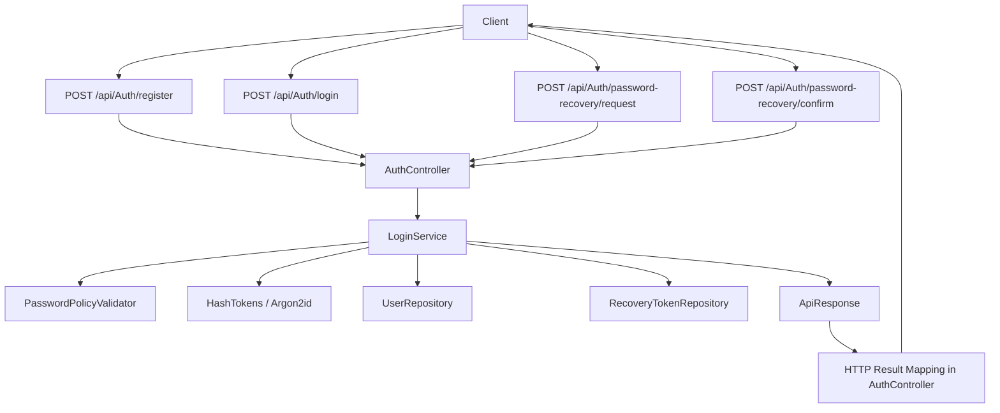

# Movie Library API

A .NET Web API for managing movies, TV shows, seasons, episodes, and mixed media lists, with authentication and password recovery support.

## Current Status

This project currently uses:

- ASP.NET Core Web API (`net10.0`)
- Entity Framework Core + PostgreSQL (`Npgsql`)
- EF Core Migrations
- Swagger / OpenAPI
- Layered structure split into:
  - `movieLibraryAPI` (API host, controllers, data access)
  - `movieLibrary.Service` (domain models, DTOs, services, security logic)

---

## Implemented Features

- CRUD operations for Movies
- CRUD operations for TV Shows
- TV Shows with Seasons and Episodes
- Combined list model (`MovieAndTvShowList`)
- Authentication flow:
  - Register
  - Login
  - Password recovery request
  - Password recovery confirm/reset
- Security components:
  - `LoginService`
  - `PasswordPolicyValidator`
  - `HashTokens`
  - User repository + recovery token repository
- `AuthController` integrated with service-layer `ApiResponse<T>` pattern

---

## Project Structure

````text
movieLibrary/
├── movieLibraryAPI/
│   ├── Controllers/
│   │   ├── AuthController.cs
│   │   ├── MovieApiController.cs
│   │   └── TvShowApiController.cs
│   ├── Data/
│   │   ├── DbContext.cs
│   │   ├── Migrations/
│   │   └── Repositories/
│   │       ├── Interfaces/
│   │       ├── UserRepository.cs
│   │       └── RecoveryTokenRepository.cs
│   ├── Mappings/
│   ├── Program.cs
│   └── movieLibraryAPI.csproj
└── movieLibrary.Service
    ├── Models/
    │   ├── Domain/
    │   ├── DTOs/
    │   └── Response/
    ├── Services/
    │   ├── MovieService.cs
    │   ├── TvShowService.cs
    │   └── Security/
    │       ├── LoginService.cs
    │       ├── HashTokens.cs
    │       ├── PasswordPolicyValidator.cs
    │       └── Interfaces/
    └── movieLibraryService.csproj
````

## Authentication Flow



## TODO for project

- [x] Create User model
- [x] Make login service file
- [x] Decide between bcrypt and Argon2
- [x] Make DTOs for Users
- [x] Create IUserRepository and UserRepository
- [x] Make IRecoveryTokenRepository + RecoveryToken entity/table
- [x] Create PasswordPolicyValidator (length/complexity rules)
- [x] Add Argon2 to log-in services
- [x] Move Models and Service folders to movieLibrary.Service folder
- [ ] Build view files for the lists
- [x] Make AuthController (register/login/recovery endpoints)
- [ ] Set up Docker with compose and file

## Auth Endpoints

Base route: api/Auth

- POST '/api/Auth/register'
- POST '/api/Auth/login'
- POST '/api/Auth/password-recovery/request'
- POST '/api/Auth/password-recovery/confirm'

## Database

The API is configured for **PostgreSQL** in `Program.cs` using:

- `AddDbContext<MovieLibraryDbContext>(options => options.UseNpgsql(...))`
- Connection string key: `ConnectionStrings:DefaultConnection`

Example connection string in `appsettings.json`:

```json
{
  "ConnectionStrings": {
    "DefaultConnection": "Host=localhost;Port=5432;Database=movielibrary;Username=postgres;Password=postgres"
  }
}
```

## Local Setup

### 1) Prerequisites

- .NET SDK 10
- PostgreSQL server running on localhost:5432
- `postgresql-client` (`psql`) installed

### 2) Install local EF tool (recommended)

From repo root:

```bash
dotnet new tool-manifest
dotnet tool install dotnet-ef
dotnet tool restore
```

### 3) Restore and build

```bash
cd movieLibraryAPI
dotnet restore
dotnet build
```

### 4) Apply migrations

From repo root:

```bash
dotnet tool run dotnet-ef database update \
  --project movieLibraryAPI/movieLibraryAPI.csproj \
  --startup-project movieLibraryAPI/movieLibraryAPI.csproj \
  --context MovieLibraryDbContext
```

### 5) Run API

```bash
cd movieLibraryAPI
dotnet run
```

Swagger UI is available in Development mode (default local run).

---

## Useful Commands

Create a new migration:

```bash
dotnet tool run dotnet-ef migrations add <MigrationName> \
  --project movieLibraryAPI/movieLibraryAPI.csproj \
  --startup-project movieLibraryAPI/movieLibraryAPI.csproj \
  --context MovieLibraryDbContext \
  --output-dir Data/Migrations
```

Check database tables:

```bash
psql "host=localhost port=5432 dbname=movielibrary user=postgres password=postgres" -c "\dt"
```

---

## Development Notes

- EF migration files in `Data/Migrations` are source-controlled and should remain in Git.
- `.config/dotnet-tools.json` should also be committed for consistent local tooling.
- `bin/` and `obj/` should remain ignored.

---

## Stretch Goal

- React(native) frontend consuming this API.
